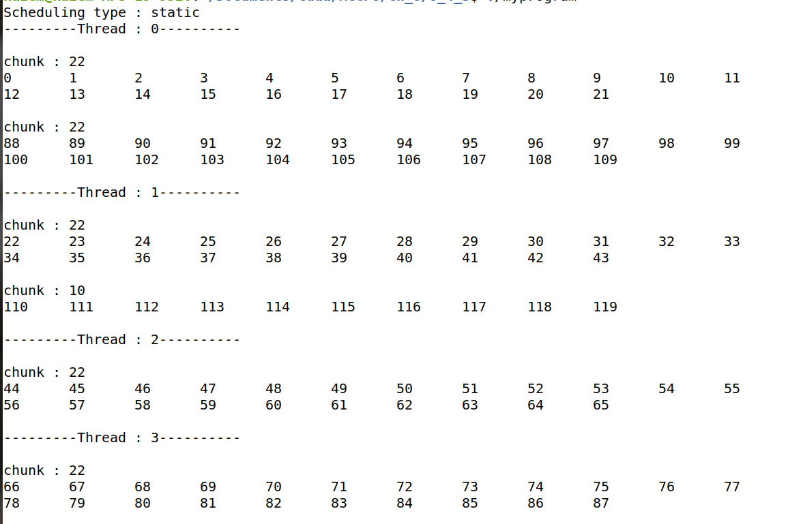
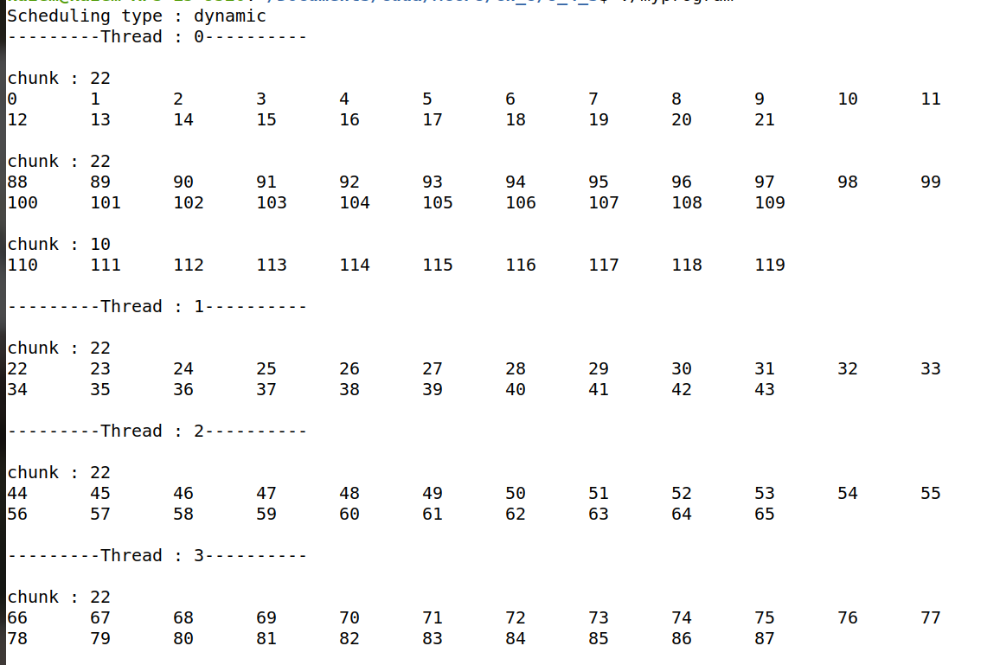
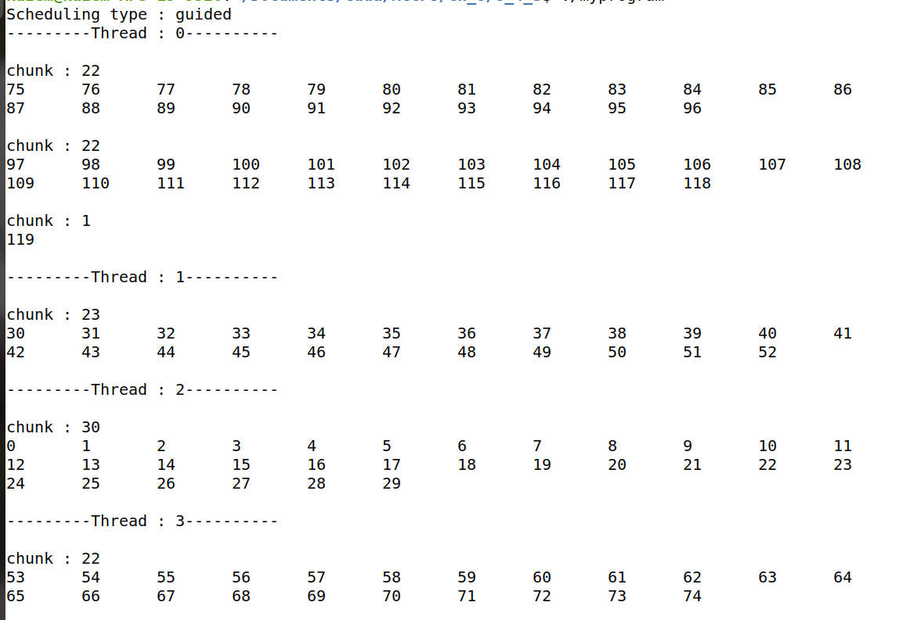

# The Schedule Clause in OpenMP

When the execution of a program encounters the loop directive of OpenMP, the distribution of the loop iterations among the threads is affected by the schedule clause (if present) or the internal control variables (ICV) 'run-sched-var' and 'def-sched-var'.

If there is no schedule clause, the default scheduling scheme stored in the 'run-sched-var' ICV is used.

If there is a schedule clause for the 'omp for' directive, the value of the schedule clause determines the schedule.

If loop iterations vary significantly in execution time, the performance of the OpenMP parallel loop may degrade.

There are five available scheduling schemes, which can be set using the following syntax for a loop with size N and T threads:

```c

schedule(kind,chunk-size)

```

A sample code is used to visualize the distribution of loop iteration (N=120) across four threads (T=4) using different schedules (kind). 

### Kind=static:

It breaks the entire loop into chunk-size groups and distributes them among the OpenMP threads in a round-robin fashion. If the chunk-size is not present, the default value is [N/T].

It is suitable when the cost for each loop iteration is approximately the same.



### Kind=dynamic:

The entire loop iteration is divided into groups of chunk-size size. A thread executes a group and requests another one until there is no group remaining.

When chunk-size is not specified, its default is 1.



### Kind=guided:

Each thread executes a group and then requests another, with the group size decreasing gradually down to the specified chunk-size. 

The main difference with the dynamic schedule is that the size of the groups is not constant and decreases until reaching the chunk-size. 

The size of each chunk distributed between threads is proportional to the number of unassigned iterations (remaining) divided by the number of threads (T) in the team with the restriction that the chunks do not contain fewer than chunk-size iterations.

When chunk-size is not specified, its default is 1.



### Kind=auto:

With schedule(auto), the scheduling decision is delegated to the compiler or OpenMP runtime, which selects the most suitable scheme.

### Kind=runtime:

Using the schedule(runtime), the decision about scheduling is postponed until run time. At that point, the schedule and chunk size are taken from the run-sched-var ICV.
