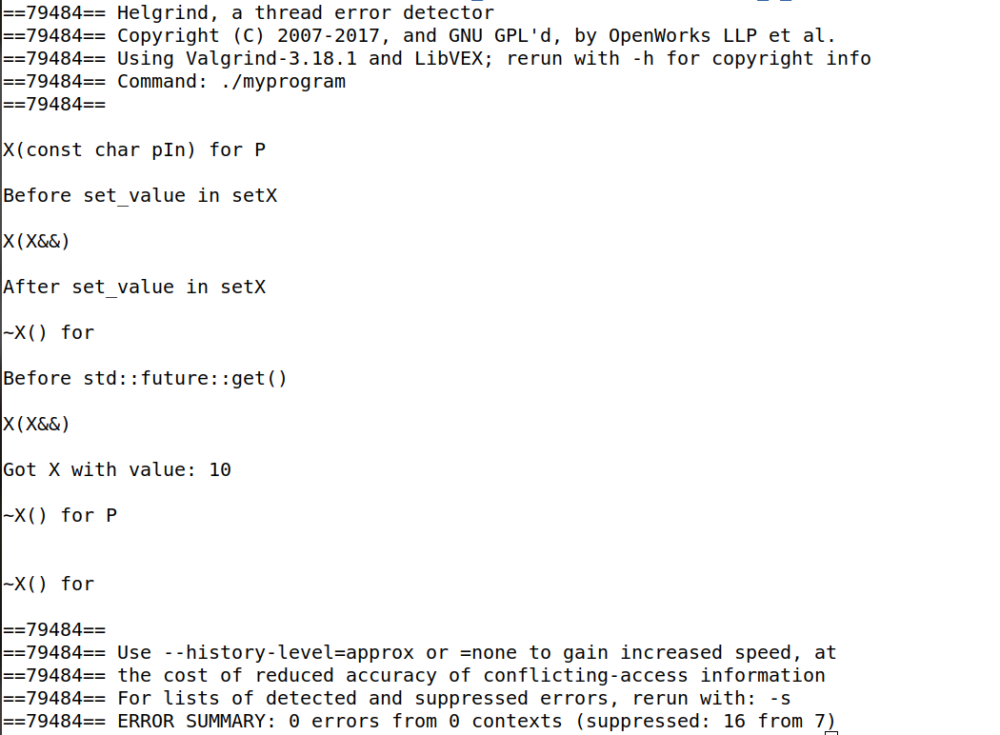

# Transmitting a Single Value Using Promises and Futures:

A problem can potentially be divided into many smaller tasks, each accepting some arguments and providing a single result. 

The promise and future introduced in C++11 provide a mechanism for transmitting a single value produced in a task to another. A task puts its single result into a promise object, and another task retrieves it using the corresponding future object. 

Each promise is associated with a shared state that contains both status information and the result. The threads use the state information to communicate safely, including a ready bit, count, and mutual exclusive data. 

The important feature of this facility is that the programmer does not need to use synchronization primitives such as mutex, and the underlying system implements the transfer efficiently.

## std::promise:

The std::promise is a handle to the shared state, allowing a task to store a result that can later be retrieved via the corresponding std::future.

The promise object is not copyable.

The important feature is that a single-value result is transmitted from one task to another task through the shared state without any copy operation involved, so we can move a collection of objects, such as those stored in a std::vector, cheaply from one thread to another thread.
 
## std::future:

The std::future object is a handle to the shared state, and it is used to get the result deposited by the std::promise.

The std::future object is not copyable.

## The code output

